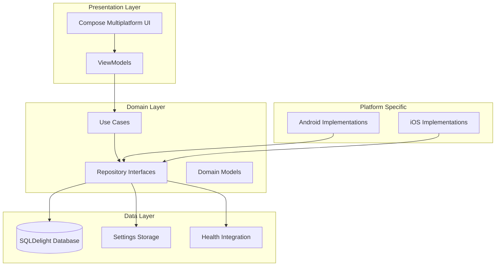

# Design Document

## Overview

Tabata Timer Pro is built using Kotlin Multiplatform Mobile (KMP) with Compose Multiplatform for shared UI development. The architecture leverages the existing KMP project structure with shared business logic, cross-platform UI components, and platform-specific implementations for background tasks, audio management, and health integrations.

The app follows MVVM architecture with Compose, utilizing coroutines for timer management and reactive state handling. The design prioritizes accuracy, reliability, and seamless background operation while maintaining a clean, accessible user interface.

## Architecture

### High-Level Architecture



### Module Structure

- **shared/**: Core business logic, data models, repositories
- **composeApp/**: Shared UI components and screens
- **androidApp/**: Android-specific implementations (background services, notifications)
- **iosApp/**: iOS-specific implementations (background tasks, HealthKit)

## Components and Interfaces

### Core Timer System

#### TimerEngine
```kotlin
interface TimerEngine {
    val timerState: StateFlow<TimerState>
    suspend fun start(configuration: TimerConfiguration)
    suspend fun pause()
    suspend fun resume()
    suspend fun stop()
    suspend fun skipPhase()
    suspend fun correctTimeFromBackground(backgroundDuration: Duration)
}

class TimerEngineImpl : TimerEngine {
    private var startTimeMillis: Long = 0
    private var pausedTimeMillis: Long = 0
    private var totalPausedDuration: Long = 0
    
    // Use monotonic clock to prevent drift
    private fun getCurrentAccurateTime(): Long = System.currentTimeMillis()
    
    private fun calculateRemainingTime(): Duration {
        val currentTime = getCurrentAccurateTime()
        val elapsedTime = currentTime - startTimeMillis - totalPausedDuration
        return maxOf(0, targetEndTime - currentTime).milliseconds
    }
    
    // Drift correction mechanism
    private fun correctTimerDrift() {
        val expectedTime = calculateExpectedTime()
        val actualTime = getCurrentAccurateTime()
        val drift = actualTime - expectedTime
        if (abs(drift) > DRIFT_THRESHOLD_MS) {
            adjustTimerForDrift(drift)
        }
    }
    
    companion object {
        private const val DRIFT_THRESHOLD_MS = 100L // 100ms tolerance
    }
}
```

#### TimerState
```kotlin
data class TimerState(
    val status: TimerStatus,
    val currentPhase: PhaseType,
    val phaseTimeRemaining: Duration,
    val totalTimeRemaining: Duration,
    val currentRound: Int,
    val totalRounds: Int,
    val currentSet: Int,
    val totalSets: Int
)

enum class TimerStatus { IDLE, RUNNING, PAUSED, COMPLETED }
enum class PhaseType { WARMUP, WORK, REST, SET_BREAK, COOLDOWN }
```

#### PhaseManager
```kotlin
interface PhaseManager {
    fun calculateNextPhase(current: TimerState, config: TimerConfiguration): PhaseType?
    fun getPhaseColor(phase: PhaseType): Color
    fun getPhaseDisplayName(phase: PhaseType): String
}
```

### Audio System

#### AudioManager
```kotlin
interface AudioManager {
    suspend fun playTTS(text: String, language: String)
    suspend fun playSound(soundType: SoundType)
    suspend fun enableMusicDucking()
    suspend fun disableMusicDucking()
    fun setVolume(volume: Float)
    suspend fun getSupportedLanguages(): List<String>
    suspend fun validateLanguageSupport(language: String): LanguageSupport
}

enum class SoundType {
    PHASE_START, PHASE_END, COUNTDOWN_3, COUNTDOWN_1, HALFWAY_POINT
}

data class LanguageSupport(
    val isSupported: Boolean,
    val fallbackLanguage: String? = null,
    val quality: TTSQuality
)

enum class TTSQuality { HIGH, MEDIUM, LOW, FALLBACK }

class AudioManagerImpl : AudioManager {
    companion object {
        private const val DEFAULT_FALLBACK_LANGUAGE = "en-US"
        private val SUPPORTED_FALLBACK_CHAIN = listOf("en-US", "en-GB", "en")
    }
    
    override suspend fun playTTS(text: String, language: String) {
        val languageSupport = validateLanguageSupport(language)
        val actualLanguage = if (languageSupport.isSupported) {
            language
        } else {
            languageSupport.fallbackLanguage ?: DEFAULT_FALLBACK_LANGUAGE
        }
        
        // Use actualLanguage for TTS with fallback notification to user
        playTTSWithLanguage(text, actualLanguage)
    }
    
    override suspend fun validateLanguageSupport(language: String): LanguageSupport {
        // Check platform-specific TTS engine support
        // Return fallback language if requested language not available
        // Prioritize fallback chain: requested → en-US → en-GB → en
    }
}
```

### Data Persistence

#### Database Schema (SQLDelight)
```sql
-- Schema Version 1
CREATE TABLE TimerPreset (
    id INTEGER PRIMARY KEY AUTOINCREMENT,
    name TEXT NOT NULL,
    warmupDuration INTEGER NOT NULL CHECK(warmupDuration >= 0 AND warmupDuration <= 3600000), -- Max 1 hour
    workDuration INTEGER NOT NULL CHECK(workDuration >= 1000 AND workDuration <= 3600000), -- Min 1s, Max 1 hour
    restDuration INTEGER NOT NULL CHECK(restDuration >= 0 AND restDuration <= 3600000),
    setBreakDuration INTEGER NOT NULL CHECK(setBreakDuration >= 0 AND setBreakDuration <= 3600000),
    cooldownDuration INTEGER NOT NULL CHECK(cooldownDuration >= 0 AND cooldownDuration <= 3600000),
    rounds INTEGER NOT NULL CHECK(rounds >= 1 AND rounds <= 100), -- Reasonable limits
    sets INTEGER NOT NULL CHECK(sets >= 1 AND sets <= 20),
    audioSettings TEXT NOT NULL, -- JSON with size limit validation
    createdAt INTEGER NOT NULL,
    updatedAt INTEGER NOT NULL,
    schemaVersion INTEGER NOT NULL DEFAULT 1
);

-- Workout History table
CREATE TABLE WorkoutSession (
    id INTEGER PRIMARY KEY AUTOINCREMENT,
    presetId INTEGER NOT NULL,
    startTime INTEGER NOT NULL,
    endTime INTEGER,
    completed INTEGER NOT NULL DEFAULT 0,
    totalDuration INTEGER NOT NULL,
    backgroundTime INTEGER DEFAULT 0, -- Time spent in background
    driftCorrections INTEGER DEFAULT 0, -- Number of drift corrections applied
    FOREIGN KEY (presetId) REFERENCES TimerPreset(id)
);

-- User Settings table
CREATE TABLE UserSettings (
    key TEXT PRIMARY KEY,
    value TEXT NOT NULL
);

-- Weight Tracking table (Premium feature)
CREATE TABLE WeightEntry (
    id INTEGER PRIMARY KEY AUTOINCREMENT,
    weight REAL NOT NULL CHECK(weight >= 20.0 AND weight <= 400.0), -- Reasonable weight range
    height REAL CHECK(height IS NULL OR (height >= 100.0 AND height <= 240.0)), -- Reasonable height range in cm
    bmi REAL CHECK(bmi IS NULL OR (bmi >= 10.0 AND bmi <= 60.0)), -- Reasonable BMI range
    timestamp INTEGER NOT NULL,
    notes TEXT,
    syncedToHealth INTEGER NOT NULL DEFAULT 0, -- Track health platform sync status
    retryCount INTEGER NOT NULL DEFAULT 0 -- For sync retry mechanism
);

-- Subscription table
CREATE TABLE SubscriptionStatus (
    id INTEGER PRIMARY KEY,
    productId TEXT NOT NULL,
    purchaseToken TEXT,
    isActive INTEGER NOT NULL DEFAULT 0,
    expiryDate INTEGER,
    lastVerified INTEGER NOT NULL,
    gracePeriodEnd INTEGER, -- Grace period for expired subscriptions
    restoreAttempts INTEGER NOT NULL DEFAULT 0 -- Track restore purchase attempts
);

-- Migration Scripts
-- Version 1 to 2 example:
-- ALTER TABLE TimerPreset ADD COLUMN schemaVersion INTEGER NOT NULL DEFAULT 1;
-- ALTER TABLE WorkoutSession ADD COLUMN backgroundTime INTEGER DEFAULT 0;
-- ALTER TABLE WorkoutSession ADD COLUMN driftCorrections INTEGER DEFAULT 0;
```

#### Repository Pattern
```kotlin
interface PresetRepository {
    suspend fun getAllPresets(): List<TimerPreset>
    suspend fun getPreset(id: Long): TimerPreset?
    suspend fun savePreset(preset: TimerPreset): Long
    suspend fun deletePreset(id: Long)
    suspend fun exportPreset(id: Long): String // JSON with validation
    suspend fun importPreset(json: String): TimerPreset
    suspend fun validateImportJson(json: String): ValidationResult
}

data class ValidationResult(
    val isValid: Boolean,
    val errors: List<String> = emptyList(),
    val warnings: List<String> = emptyList()
)

class PresetRepositoryImpl : PresetRepository {
    companion object {
        private const val MAX_JSON_SIZE = 10_000 // 10KB limit
        private const val MAX_PRESET_NAME_LENGTH = 50
        private const val MAX_BATCH_IMPORT_COUNT = 50 // Maximum presets per import
        private const val MAX_FIELD_NAME_LENGTH = 100
        private const val MAX_NESTING_DEPTH = 3
        private val ALLOWED_JSON_FIELDS = setOf(
            "name", "warmupDuration", "workDuration", "restDuration", 
            "setBreakDuration", "cooldownDuration", "rounds", "sets", "audioSettings"
        )
    }
    
    override suspend fun validateImportJson(json: String): ValidationResult {
        val errors = mutableListOf<String>()
        val warnings = mutableListOf<String>()
        
        // Size validation
        if (json.length > MAX_JSON_SIZE) {
            return ValidationResult(false, listOf("JSON file too large (max ${MAX_JSON_SIZE} bytes)"))
        }
        
        try {
            val jsonObject = Json.parseToJsonElement(json)
            
            // Batch import limit validation
            val presetCount = when {
                jsonObject is JsonArray -> jsonObject.size
                jsonObject is JsonObject && jsonObject.containsKey("presets") -> {
                    (jsonObject["presets"] as? JsonArray)?.size ?: 1
                }
                else -> 1
            }
            
            if (presetCount > MAX_BATCH_IMPORT_COUNT) {
                errors.add("Too many presets in batch (max $MAX_BATCH_IMPORT_COUNT, found $presetCount)")
            }
            
            // Validate JSON structure and prevent malicious payloads
            validateJsonStructure(jsonObject, 0, errors, warnings)
            
            // Field whitelist validation
            validateFieldWhitelist(jsonObject, errors)
            
            // Prevent nested or overly long field names
            validateFieldNames(jsonObject, errors)
            
        } catch (e: Exception) {
            errors.add("Invalid JSON format: ${e.message}")
        }
        
        return ValidationResult(errors.isEmpty(), errors, warnings)
    }
    
    private fun validateJsonStructure(element: JsonElement, depth: Int, errors: MutableList<String>, warnings: MutableList<String>) {
        if (depth > MAX_NESTING_DEPTH) {
            errors.add("JSON nesting too deep (max $MAX_NESTING_DEPTH levels)")
            return
        }
        
        when (element) {
            is JsonObject -> {
                element.forEach { (key, value) ->
                    if (key.length > MAX_FIELD_NAME_LENGTH) {
                        errors.add("Field name too long: $key")
                    }
                    validateJsonStructure(value, depth + 1, errors, warnings)
                }
            }
            is JsonArray -> {
                if (element.size > MAX_BATCH_IMPORT_COUNT * 2) { // Allow some overhead
                    warnings.add("Large array detected, processing may be slow")
                }
                element.forEach { validateJsonStructure(it, depth + 1, errors, warnings) }
            }
        }
    }
    
    private fun validateFieldWhitelist(element: JsonElement, errors: MutableList<String>) {
        // Validate that only allowed fields are present in preset objects
        // Reject any suspicious or unknown fields
    }
    
    private fun validateFieldNames(element: JsonElement, errors: MutableList<String>) {
        // Check for suspicious field names, excessive repetition, or malicious patterns
        // Prevent fields with special characters that could cause issues
    }
}

interface WorkoutHistoryRepository {
    suspend fun saveWorkoutSession(session: WorkoutSession)
    suspend fun getWorkoutHistory(limit: Int = 50): List<WorkoutSession>
    suspend fun getWorkoutStats(period: StatsPeriod): WorkoutStats
}

interface WeightTrackingRepository {
    suspend fun saveWeightEntry(entry: WeightEntry): Long
    suspend fun getWeightHistory(days: Int): List<WeightEntry>
    suspend fun getLatestWeight(): WeightEntry?
    suspend fun deleteWeightEntry(id: Long)
    suspend fun calculateBMI(weight: Float, height: Float): Float
}
```

### Feature Access Control

#### FeatureGateManager
```kotlin
interface FeatureGateManager {
    fun canAccessFeature(feature: PremiumFeature): Boolean
    fun getFeatureLimitStatus(feature: PremiumFeature): FeatureLimitStatus
    suspend fun showUpgradePrompt(feature: PremiumFeature)
    fun getRemainingFreeUsage(feature: PremiumFeature): Int?
}

sealed class FeatureLimitStatus {
    object Available : FeatureLimitStatus()
    object RequiresPremium : FeatureLimitStatus()
    data class LimitedUsage(val remaining: Int, val total: Int) : FeatureLimitStatus()
}

class FeatureGateManagerImpl(
    private val subscriptionManager: SubscriptionManager
) : FeatureGateManager {
    
    private val freePresetLimit = 1
    private val freeSoundEffects = setOf(SoundType.PHASE_START, SoundType.PHASE_END)
    
    override fun canAccessFeature(feature: PremiumFeature): Boolean {
        return when (feature) {
            PremiumFeature.UNLIMITED_PRESETS -> {
                subscriptionManager.subscriptionStatus.value.isActive
            }
            PremiumFeature.WEIGHT_TRACKING -> {
                subscriptionManager.subscriptionStatus.value.isActive
            }
            // ... other features
        }
    }
}
```

### Platform-Specific Implementations

#### Background Task Management
```kotlin
interface BackgroundTaskManager {
    suspend fun startBackgroundTimer(configuration: TimerConfiguration)
    suspend fun stopBackgroundTimer()
    fun isBackgroundExecutionAvailable(): Boolean
    suspend fun scheduleBackgroundNotifications(phases: List<PhaseSchedule>)
    suspend fun handleForegroundReturn(): Duration // Returns time spent in background
}

data class PhaseSchedule(
    val phaseType: PhaseType,
    val startTime: Long,
    val duration: Duration,
    val notificationText: String
)

// Android Implementation
class AndroidBackgroundTaskManager : BackgroundTaskManager {
    // Uses Foreground Service with notification + partial wakelock
    // Notification channel management for different Android versions
    private fun createNotificationChannel() { /* ... */ }
    private fun acquireWakeLock() { /* Partial wake lock for timer accuracy */ }
}

// iOS Implementation  
class IOSBackgroundTaskManager : BackgroundTaskManager {
    // Uses Local Notifications + foreground correction strategy
    // Cannot maintain continuous background execution
    override suspend fun startBackgroundTimer(configuration: TimerConfiguration) {
        // Schedule local notifications for each phase transition
        scheduleLocalNotifications(configuration)
        // Store timer state for foreground correction
        storeTimerStateForCorrection()
    }
    
    override suspend fun handleForegroundReturn(): Duration {
        // Calculate actual time spent in background
        // Correct timer state based on scheduled notifications
        return calculateBackgroundDuration()
    }
}
```

#### Health Integration
```kotlin
interface HealthDataManager {
    suspend fun isAvailable(): Boolean
    suspend fun requestPermissions(): Boolean
    suspend fun requestSpecificPermissions(permissions: Set<HealthPermission>): PermissionResult
    suspend fun getGrantedPermissions(): Set<HealthPermission>
    suspend fun logWorkout(session: WorkoutSession): HealthSyncResult
    suspend fun logHeartRate(bpm: Int, timestamp: Long): HealthSyncResult
    suspend fun logWeight(weight: Float, timestamp: Long): HealthSyncResult
    suspend fun logBodyMassIndex(bmi: Float, timestamp: Long): HealthSyncResult
    suspend fun getWeightHistory(days: Int): List<WeightEntry>
    suspend fun retryFailedSync(): List<HealthSyncResult>
    suspend fun handlePermissionDenied(): PermissionHandlingResult
    suspend fun handlePartialPermissions(granted: Set<HealthPermission>, denied: Set<HealthPermission>): PartialPermissionResult
    suspend fun resolveDataConflicts(conflicts: List<DataConflict>): ConflictResolutionResult
}

enum class HealthPermission {
    WORKOUT_DATA,
    HEART_RATE,
    WEIGHT,
    BMI,
    CALORIES_BURNED,
    EXERCISE_TIME
}

data class PermissionResult(
    val granted: Set<HealthPermission>,
    val denied: Set<HealthPermission>,
    val requiresSystemSettings: Set<HealthPermission>
)

sealed class PartialPermissionResult {
    data class ContinueWithLimitedFeatures(val availableFeatures: Set<HealthPermission>) : PartialPermissionResult()
    object ShowPermissionExplanation : PartialPermissionResult()
    object DisableHealthIntegration : PartialPermissionResult()
}

class HealthDataManagerImpl : HealthDataManager {
    private val grantedPermissions = mutableSetOf<HealthPermission>()
    
    override suspend fun handlePartialPermissions(
        granted: Set<HealthPermission>, 
        denied: Set<HealthPermission>
    ): PartialPermissionResult {
        grantedPermissions.clear()
        grantedPermissions.addAll(granted)
        
        return when {
            granted.contains(HealthPermission.WORKOUT_DATA) -> {
                // Core workout tracking available, continue with limited features
                PartialPermissionResult.ContinueWithLimitedFeatures(granted)
            }
            granted.isEmpty() -> {
                // No permissions granted, disable health integration
                PartialPermissionResult.DisableHealthIntegration
            }
            else -> {
                // Some permissions granted, show explanation for missing features
                PartialPermissionResult.ShowPermissionExplanation
            }
        }
    }
    
    override suspend fun logWeight(weight: Float, timestamp: Long): HealthSyncResult {
        return if (grantedPermissions.contains(HealthPermission.WEIGHT)) {
            performWeightSync(weight, timestamp)
        } else {
            HealthSyncResult.PermissionDenied
        }
    }
    
    override suspend fun logHeartRate(bpm: Int, timestamp: Long): HealthSyncResult {
        return if (grantedPermissions.contains(HealthPermission.HEART_RATE)) {
            performHeartRateSync(bpm, timestamp)
        } else {
            HealthSyncResult.PermissionDenied
        }
    }
    
    private suspend fun performWeightSync(weight: Float, timestamp: Long): HealthSyncResult {
        // Platform-specific weight sync implementation
        return HealthSyncResult.Success
    }
    
    private suspend fun performHeartRateSync(bpm: Int, timestamp: Long): HealthSyncResult {
        // Platform-specific heart rate sync implementation
        return HealthSyncResult.Success
    }
}

sealed class HealthSyncResult {
    object Success : HealthSyncResult()
    object PermissionDenied : HealthSyncResult()
    data class NetworkError(val retryable: Boolean) : HealthSyncResult()
    data class ConflictDetected(val conflict: DataConflict) : HealthSyncResult()
}

data class DataConflict(
    val localData: Any,
    val remoteData: Any,
    val timestamp: Long,
    val conflictType: ConflictType
)

enum class ConflictType { WEIGHT_MISMATCH, WORKOUT_DUPLICATE, BMI_INCONSISTENT }

sealed class PermissionHandlingResult {
    object ShowRetryPrompt : PermissionHandlingResult()
    object DisableFeature : PermissionHandlingResult()
    object ShowSettingsRedirect : PermissionHandlingResult()
}

class HealthDataManagerImpl : HealthDataManager {
    private val retryQueue = mutableListOf<PendingSyncItem>()
    
    override suspend fun retryFailedSync(): List<HealthSyncResult> {
        // Implement exponential backoff retry mechanism
        // Process queued sync items
        // Handle different failure types appropriately
    }
    
    override suspend fun resolveDataConflicts(conflicts: List<DataConflict>): ConflictResolutionResult {
        // Use timestamp-based resolution (latest wins)
        // Provide user choice for critical conflicts
        // Maintain data integrity across platforms
    }
}

data class WeightEntry(
    val weight: Float,
    val bmi: Float?,
    val timestamp: Long
)

// iOS: HealthKit implementation
// Android: Google Fit implementation
```

#### Wearable Integration
```kotlin
interface WearableManager {
    val isConnected: StateFlow<Boolean>
    suspend fun sendTimerState(state: TimerState)
    suspend fun sendTimerConfiguration(config: TimerConfiguration)
    fun observeWearableCommands(): Flow<WearableCommand>
    suspend fun syncStateWithConflictResolution(phoneState: TimerState, wearableState: TimerState): TimerState
    suspend fun handleSimultaneousCommands(commands: List<WearableCommand>): WearableCommand
}

data class StateSync(
    val timestamp: Long,
    val source: SyncSource,
    val state: TimerState
)

enum class SyncSource { PHONE, WEARABLE, NOTIFICATION }

interface WearableManager {
    val isConnected: StateFlow<Boolean>
    suspend fun sendTimerState(state: TimerState)
    suspend fun sendTimerConfiguration(config: TimerConfiguration)
    fun observeWearableCommands(): Flow<WearableCommand>
    suspend fun syncStateWithConflictResolution(phoneState: TimerState, wearableState: TimerState): TimerState
    suspend fun handleSimultaneousCommands(commands: List<WearableCommand>): WearableCommand
    suspend fun handleOfflineOperations(): List<OfflineOperation>
    suspend fun syncOfflineQueue()
}

data class OfflineOperation(
    val command: WearableCommand,
    val timestamp: Long,
    val deviceId: String
)

class WearableManagerImpl : WearableManager {
    private var lastSyncTimestamp = 0L
    private val offlineQueue = mutableListOf<OfflineOperation>()
    private var isWearableConnected = false
    
    override suspend fun syncStateWithConflictResolution(
        phoneState: TimerState, 
        wearableState: TimerState
    ): TimerState {
        // Implement "last write wins" strategy
        // Use timestamp to determine most recent state
        // Handle simultaneous operations gracefully
        // Prioritize critical operations (stop > pause > play)
    }
    
    override suspend fun handleSimultaneousCommands(commands: List<WearableCommand>): WearableCommand {
        // Define command priority: Stop > Pause > Resume > Skip
        // Return highest priority command when conflicts occur
        // Log conflicts for debugging purposes
    }
    
    override suspend fun handleOfflineOperations(): List<OfflineOperation> {
        // Return queued operations that occurred while wearable was disconnected
        return offlineQueue.toList()
    }
    
    override suspend fun syncOfflineQueue() {
        if (isWearableConnected && offlineQueue.isNotEmpty()) {
            // Process queued operations in chronological order
            val sortedOperations = offlineQueue.sortedBy { it.timestamp }
            
            for (operation in sortedOperations) {
                try {
                    // Apply operation to current state
                    processOfflineOperation(operation)
                } catch (e: Exception) {
                    // Log failed operation but continue with others
                    logOfflineOperationFailure(operation, e)
                }
            }
            
            // Clear queue after successful sync
            offlineQueue.clear()
            lastSyncTimestamp = System.currentTimeMillis()
        }
    }
    
    private suspend fun processOfflineOperation(operation: OfflineOperation) {
        // Apply the queued operation to current timer state
        // Handle conflicts with current state appropriately
        when (operation.command) {
            is WearableCommand.Play -> handleOfflinePlay(operation)
            is WearableCommand.Pause -> handleOfflinePause(operation)
            is WearableCommand.Stop -> handleOfflineStop(operation)
            is WearableCommand.Skip -> handleOfflineSkip(operation)
        }
    }
    
    private fun queueOfflineOperation(command: WearableCommand) {
        if (!isWearableConnected) {
            offlineQueue.add(
                OfflineOperation(
                    command = command,
                    timestamp = System.currentTimeMillis(),
                    deviceId = getWearableDeviceId()
                )
            )
        }
    }
    
    private fun simplifyUIForSmallScreen(state: TimerState): WearableDisplayState {
        // Reduce information density for watch screens
        // Emphasize current phase and time remaining
        // Use strong haptic feedback for phase transitions
        // Minimize text, maximize visual indicators
    }
    
    private suspend fun handleOfflinePlay(operation: OfflineOperation) {
        // Handle play command that was queued while offline
    }
    
    private suspend fun handleOfflinePause(operation: OfflineOperation) {
        // Handle pause command that was queued while offline
    }
    
    private suspend fun handleOfflineStop(operation: OfflineOperation) {
        // Handle stop command that was queued while offline
    }
    
    private suspend fun handleOfflineSkip(operation: OfflineOperation) {
        // Handle skip command that was queued while offline
    }
    
    private fun getWearableDeviceId(): String {
        // Return unique identifier for the wearable device
        return "wearable_device_id"
    }
    
    private fun logOfflineOperationFailure(operation: OfflineOperation, error: Exception) {
        // Log failed offline operation for debugging
    }
}

sealed class WearableCommand {
    object Play : WearableCommand()
    object Pause : WearableCommand()
    object Stop : WearableCommand()
    object Skip : WearableCommand()
}
```

#### Subscription Management
```kotlin
interface SubscriptionManager {
    val subscriptionStatus: StateFlow<SubscriptionStatus>
    suspend fun checkSubscriptionStatus(): SubscriptionStatus
    suspend fun purchaseSubscription(productId: String): PurchaseResult
    suspend fun restorePurchases(): RestoreResult
    suspend fun handleSubscriptionExpiry(): ExpiryHandlingResult
    fun isFeatureAvailable(feature: PremiumFeature): Boolean
    fun isInGracePeriod(): Boolean
}

data class SubscriptionStatus(
    val isActive: Boolean,
    val productId: String?,
    val expiryDate: Long?,
    val lastVerified: Long,
    val gracePeriodEnd: Long? = null, // Grace period for expired subscriptions
    val needsRestore: Boolean = false // Indicates if restore is recommended
)

sealed class ExpiryHandlingResult {
    object GracefulDowngrade : ExpiryHandlingResult()
    object GracePeriodExtended : ExpiryHandlingResult()
    data class RestoreRequired(val message: String) : ExpiryHandlingResult()
}

interface SubscriptionVerificationService {
    suspend fun verifyPurchaseWithServer(purchaseToken: String, productId: String): ServerVerificationResult
    suspend fun isServerVerificationAvailable(): Boolean
}

sealed class ServerVerificationResult {
    object Verified : ServerVerificationResult()
    object Invalid : ServerVerificationResult()
    object ServerUnavailable : ServerVerificationResult()
    data class Error(val message: String) : ServerVerificationResult()
}

class SubscriptionManagerImpl(
    private val verificationService: SubscriptionVerificationService? = null
) : SubscriptionManager {
    
    override suspend fun checkSubscriptionStatus(): SubscriptionStatus {
        val localStatus = getLocalSubscriptionStatus()
        
        // Try server verification if available
        verificationService?.let { service ->
            if (service.isServerVerificationAvailable() && localStatus.isActive) {
                val serverResult = service.verifyPurchaseWithServer(
                    localStatus.purchaseToken ?: "", 
                    localStatus.productId ?: ""
                )
                
                return when (serverResult) {
                    is ServerVerificationResult.Verified -> localStatus
                    is ServerVerificationResult.Invalid -> localStatus.copy(isActive = false)
                    is ServerVerificationResult.ServerUnavailable -> {
                        // Fallback to local validation with grace period
                        handleServerUnavailableFallback(localStatus)
                    }
                    is ServerVerificationResult.Error -> {
                        // Use local validation but mark for retry
                        localStatus.copy(needsRestore = true)
                    }
                }
            }
        }
        
        // Fallback to local validation
        return validateSubscriptionLocally(localStatus)
    }
    
    override suspend fun handleSubscriptionExpiry(): ExpiryHandlingResult {
        // Gracefully downgrade premium features
        // Preserve user data but limit access
        // Provide restore purchase options
        // Handle cross-platform subscription sync issues
    }
    
    private suspend fun syncCrossPlatformSubscription() {
        // Handle StoreKit vs Google Play Billing differences
        // Implement fallback verification strategies
        // Local signature/hash validation when no server available
    }
    
    private suspend fun handleServerUnavailableFallback(localStatus: SubscriptionStatus): SubscriptionStatus {
        // Extend grace period when server is unavailable
        // Use local cryptographic validation as fallback
        // Log for later server verification when available
        return localStatus.copy(
            gracePeriodEnd = System.currentTimeMillis() + GRACE_PERIOD_MS,
            needsRestore = false
        )
    }
    
    private suspend fun validateSubscriptionLocally(status: SubscriptionStatus): SubscriptionStatus {
        // Implement local signature validation
        // Check purchase token integrity
        // Validate expiry dates with reasonable tolerance
        return status
    }
    
    companion object {
        private const val GRACE_PERIOD_MS = 7 * 24 * 60 * 60 * 1000L // 7 days
    }
}

data class SubscriptionStatus(
    val isActive: Boolean,
    val productId: String?,
    val expiryDate: Long?,
    val lastVerified: Long
)

enum class PremiumFeature {
    UNLIMITED_PRESETS,
    ADVANCED_STATISTICS,
    WEIGHT_TRACKING,
    ALL_SOUND_EFFECTS,
    AD_FREE_EXPERIENCE,
    PRESET_EXPORT_IMPORT,
    CUSTOM_THEMES
}

sealed class PurchaseResult {
    object Success : PurchaseResult()
    object UserCancelled : PurchaseResult()
    data class Error(val message: String) : PurchaseResult()
}

// Platform-specific implementations
// iOS: StoreKit 2 integration
// Android: Google Play Billing integration
```

## Data Models

### Core Models
```kotlin
data class TimerConfiguration(
    val name: String,
    val warmupDuration: Duration,
    val workDuration: Duration,
    val restDuration: Duration,
    val setBreakDuration: Duration,
    val cooldownDuration: Duration,
    val rounds: Int,
    val sets: Int,
    val audioSettings: AudioSettings
)

data class AudioSettings(
    val ttsEnabled: Boolean,
    val soundEffectsEnabled: Boolean,
    val vibrationEnabled: Boolean,
    val musicDuckingEnabled: Boolean,
    val countdownAlerts: Set<CountdownAlert>,
    val language: String
)

enum class CountdownAlert(val secondsBefore: Int) {
    THREE_SECONDS(3),
    HALFWAY_POINT(-1), // Special case
    PHASE_END(0)
}

data class WeightEntry(
    val id: Long = 0,
    val weight: Float,
    val height: Float? = null,
    val bmi: Float? = null,
    val timestamp: Long,
    val notes: String? = null
)

data class WeightStats(
    val currentWeight: Float?,
    val currentBMI: Float?,
    val weightChange7Days: Float?,
    val weightChange30Days: Float?,
    val bmiCategory: BMICategory?,
    val entries: List<WeightEntry>
)

enum class BMICategory {
    UNDERWEIGHT,
    NORMAL,
    OVERWEIGHT,
    OBESE
}
```

### UI Models
```kotlin
data class TimerDisplayState(
    val timeText: String,
    val phaseText: String,
    val phaseColor: Color,
    val progress: Float,
    val roundText: String,
    val setText: String,
    val isRunning: Boolean,
    val canPause: Boolean,
    val canSkip: Boolean
)
```

## Error Handling

### Error Types
```kotlin
sealed class TimerError : Exception() {
    object BackgroundExecutionDenied : TimerError()
    object AudioPermissionDenied : TimerError()
    object HealthPermissionDenied : TimerError()
    data class DatabaseError(override val message: String) : TimerError()
    data class WearableConnectionError(override val message: String) : TimerError()
}

sealed class SubscriptionError : Exception() {
    object NetworkError : SubscriptionError()
    object StoreNotAvailable : SubscriptionError()
    object ProductNotFound : SubscriptionError()
    object PurchaseAlreadyOwned : SubscriptionError()
    data class ValidationError(override val message: String) : SubscriptionError()
}

sealed class WeightTrackingError : Exception() {
    object InvalidWeight : WeightTrackingError()
    object InvalidHeight : WeightTrackingError()
    object PremiumRequired : WeightTrackingError()
    data class SyncError(override val message: String) : WeightTrackingError()
}
```

### Error Recovery Strategies
1. **Background Execution Failure**: 
   - Fallback: Foreground-only mode with user notification
   - User Action: "Enable background app refresh in Settings"
   - Recovery: Automatic retry when app returns to foreground

2. **Audio Failures**: 
   - Fallback: Disable audio features gracefully, maintain visual feedback
   - User Action: "Check audio permissions and volume settings"
   - Recovery: Provide audio test functionality in settings

3. **Database Errors**: 
   - Fallback: Use in-memory storage, preserve current session
   - User Action: "Restart app to restore saved data"
   - Recovery: Automatic database repair on next launch, backup/restore options

4. **Health Integration Errors**: 
   - Fallback: Continue workout tracking locally, queue for retry
   - User Action: "Grant health permissions in Settings app"
   - Recovery: Exponential backoff retry, manual sync option

5. **Wearable Connection Issues**: 
   - Fallback: Continue on phone, show connection status
   - User Action: "Check Bluetooth and wearable app installation"
   - Recovery: Automatic reconnection attempts, manual pairing option

6. **Subscription Validation Errors**:
   - Fallback: Grace period mode with limited features
   - User Action: "Restore purchases or check internet connection"
   - Recovery: Offline validation fallback, restore purchase flow

7. **Timer Drift/Accuracy Issues**:
   - Fallback: Automatic drift correction, user notification if significant
   - User Action: "Restart timer if accuracy issues persist"
   - Recovery: Enhanced monitoring, alternative timing mechanisms

8. **Import/Export Failures**:
   - Fallback: Preserve original data, show validation errors
   - User Action: "Check file format and try again"
   - Recovery: Partial import with warnings, format conversion options

### User Feedback
- Toast messages for temporary issues
- Dialog boxes for permission requests
- Settings screen indicators for feature availability
- Graceful degradation with clear status indicators

## Testing Strategy

### Unit Testing (Minimum Coverage Requirements)
- **Timer Logic**: 95% coverage - Verify phase transitions, timing accuracy, drift correction
- **Data Layer**: 85% coverage - Repository implementations, database operations, migration scripts
- **Use Cases**: 90% coverage - Business logic validation, error handling, fallback mechanisms
- **Utilities**: 80% coverage - Time formatting, configuration validation, JSON parsing
- **Subscription Logic**: 90% coverage - Feature gating, expiry handling, restore purchases

### Integration Testing
- **Timer Accuracy**: 30-60 minute continuous operation tests with <100ms drift tolerance
- **Background Execution**: Verify timer continues when app is backgrounded for 10+ minutes
- **Audio Integration**: Test TTS, sound effects, music ducking with different audio apps
- **Database Operations**: Full CRUD operations with real database, migration testing
- **Cross-Platform Sync**: Subscription status sync between iOS and Android

### End-to-End Testing
- **Complete Workout Flow**: Preset creation → Timer execution → Session save → History view
- **Premium Feature Flow**: Purchase → Feature unlock → Expiry → Graceful downgrade
- **Background Recovery Flow**: Start timer → Background app → Return → State correction
- **Health Integration Flow**: Workout completion → Health data sync → Conflict resolution
- **Wearable Sync Flow**: Phone timer → Wearable display → Remote control → State sync

### UI Testing
- **Compose Tests**: Screen rendering, user interactions, state updates
- **Navigation**: Screen transitions, deep linking, back navigation
- **Accessibility**: Screen reader compatibility, high contrast mode, large text
- **Responsive Design**: Different screen sizes, orientations, tablet layouts
- **Error State UI**: Error messages, retry buttons, fallback displays

### Platform-Specific Testing
- **Android**: 
  - Foreground service behavior across different Android versions
  - Notification handling and user interaction
  - Google Fit integration and permission handling
  - Battery optimization whitelist scenarios
- **iOS**: 
  - Background app refresh limitations and local notification fallback
  - HealthKit integration and permission changes
  - WatchConnectivity and state synchronization
  - App Store subscription validation
- **Wearables**: 
  - Apple Watch complications and app lifecycle
  - Wear OS tiles and notification actions
  - Cross-device state consistency

### Performance Testing
- **Memory Usage**: Monitor for memory leaks during 60+ minute sessions
- **Battery Impact**: Measure power consumption in background vs foreground modes
- **Timer Precision**: Verify <50ms accuracy over 60-minute periods
- **Database Performance**: Query optimization for 1000+ workout history records
- **UI Performance**: Ensure <16ms frame times during timer updates

### Stress Testing
- **Long Duration Workouts**: Test 2+ hour custom workouts
- **Rapid State Changes**: Pause/resume cycles every few seconds
- **Large Data Sets**: 1000+ presets, 10000+ workout sessions
- **Network Interruption**: Health sync and subscription validation during poor connectivity
- **Device Resource Constraints**: Low memory, low battery scenarios

### Security Testing
- **Subscription Validation**: Test against modified purchase tokens
- **JSON Import**: Malformed JSON, oversized files, malicious content
- **Data Validation**: SQL injection attempts, invalid data ranges
- **Permission Handling**: Revoked permissions, partial permissions

### Accessibility Testing
- **Screen Reader Support**: VoiceOver (iOS) and TalkBack (Android) full navigation
- **High Contrast Mode**: Ensure visibility in accessibility modes
- **Large Text Support**: Dynamic type scaling up to 200%
- **Motor Accessibility**: Large touch targets (44pt minimum), voice control support
- **Cognitive Accessibility**: Clear error messages, consistent navigation patterns